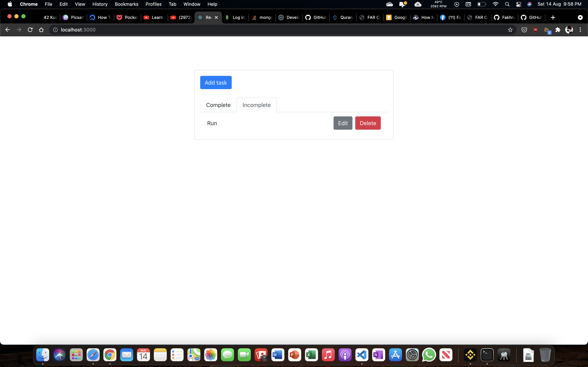
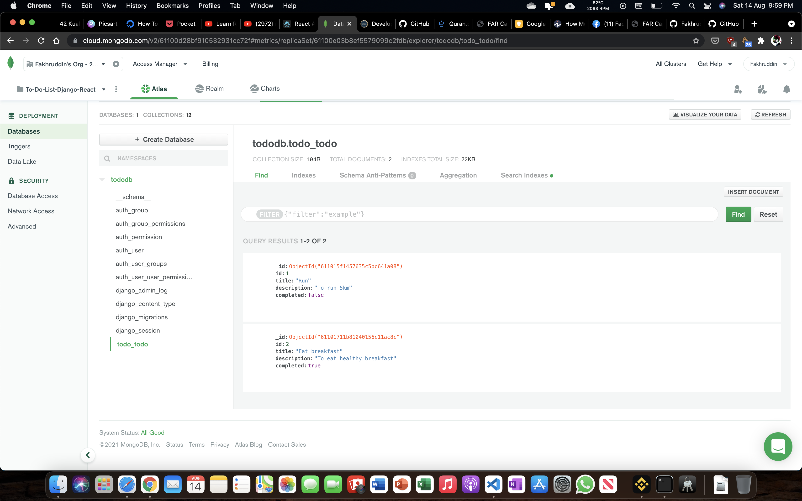

# django-todo-react

## Description
- TODO app using django (backend) and react (frontend)
- server mongodb atlas

## Start BACKEND server
```
cd backend
python manage.py runserver
```
============================
## Start FRONTEND server
```
cd frontend
npm start
```

## Screenshot

#
